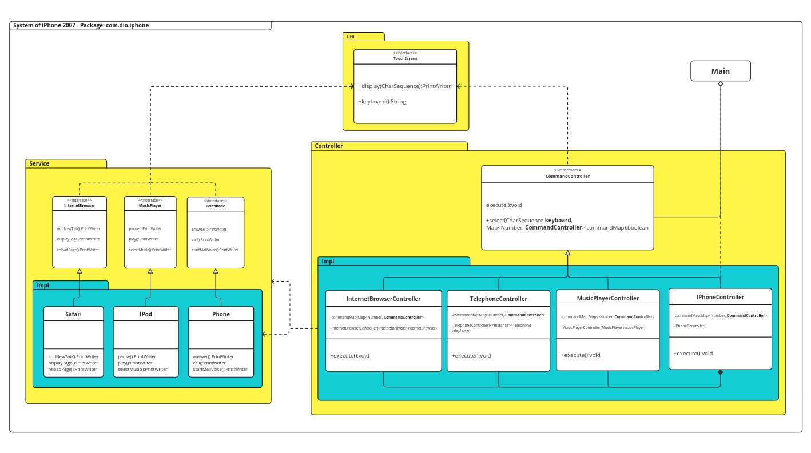

# Challenge IPhone Diagram

This is a study project, a challenge from [DIO](https://www.dio.me/bootcamp/formacao-java-developer) that finalizes the
module of Object-Oriented Programming. This project involves high-level development, simulating the main features of the
first [iPhone 2007, following Steve Jobs presentation](https://www.youtube.com/watch?v=9ou608QQRq8). The main features
involve representing the roles of the iPhone 2007, which were: `Telephone`, `MusicPlayer` and `InternetBrowser`. Each
representation with its own interface and implementation. The project follows the Service and Controller model, where
the Service layer has the aforementioned Representation interfaces and their implementations, the Controller layer has
the classes for user interaction, all bringing a flow of interaction in a loop menu `while(true)` - complexity O(n²),
starting `IphoneController.execute()` instantiated in the `Main`, which generates a small CLI with options from 1 to 4
where the number 4 is always the end of a loop.

## Screenshots

[Diagram: Miro Board](https://miro.com/app/board/uXjVMq9AxGE=/?share_link_id=177868589281)

## Tech Stack

**Client:** Java - OpenJDK 11

## Author

- [@wesleybritovlk](https://github.com/wesleybritovlk)
